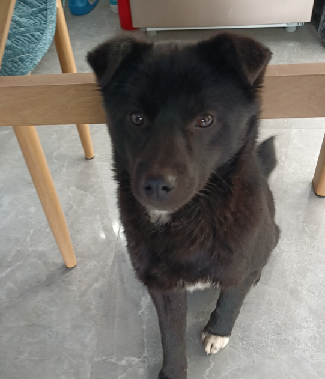

安装指南
==============

本教程面向使用 open_clip & 昇腾的开发者，帮助完成昇腾环境下 open_clip 的安装。

昇腾环境安装
------------

请根据已有昇腾产品型号及CPU架构等按照 :doc:`快速安装昇腾环境指引 <../ascend/quick_install>` 进行昇腾环境安装。

.. warning::
  CANN 最低版本为 8.0.rc1，安装 CANN 时，请同时安装 Kernel 算子包。

Python 环境创建
----------------------

.. code-block:: shell
    :linenos:
  
    # 创建 python 3.10 的虚拟环境
    conda create -n <your_env_name> python=3.10
    # 激活虚拟环境
    conda activate <your_env_name>

open_clip 安装
----------------------

使用以下指令安装 open_clip：

.. code-block:: shell
    :linenos:

    pip install open-clip-torch

torch-npu 安装
----------------------

按照 :doc:`torch-npu 安装指引 <../pytorch/install>` 安装 torch 和 torch-npu，或使用以下指令快速安装：

.. code-block:: shell
    :linenos:

    # install the dependencies
    pip3 install attrs numpy==1.26.4 decorator sympy cffi pyyaml pathlib2 psutil protobuf scipy requests absl-py wheel typing_extensions
    # install torch and torch-npu
    pip install torch==2.2.0 torch-npu==2.2.0

安装校验
----------------------

使用以下 Python 脚本对 open_clip 的安装进行校验，如下所示，正确显示 LLaMA-Factory、PyTorch NPU 和 CANN 版本号及 NPU 型号等信息即说明安装成功。

.. .. rli:: https://github.com/mlfoundations/open_clip/blob/main/tests/test_inference_simple.py
..     :language: python
..     :linenos:
.. code-block:: python
    :linenos:
    :emphasize-lines: 2,14,15,16,18

    import torch
    import torch_npu
    from PIL import Image
    import open_clip as clip

    # download model from openai and cached into cache_dir
    model = clip.openai.load_openai_model('ViT-B-32', cache_dir="/path/to/modelsViT-B-32/")

    model, _, preprocess = clip.create_model_and_transforms('ViT-B-32', pretrained='/path/to/models/ViT-B-32/ViT-B-32.pt')
    tokenizer = clip.get_tokenizer('ViT-B-32')

    # prepare a image of a diagram/dog/cat as input
    # put inputs and model to npu
    image = preprocess(Image.open("/path/to/your/image.jpg")).unsqueeze(0).to("npu")
    text = tokenizer(["a diagram", "a dog", "a cat"]).to("npu")
    model = model.to("npu")

    with torch.no_grad(), torch.npu.amp.autocast():
        image_features = model.encode_image(image)
        text_features = model.encode_text(text)
        image_features /= image_features.norm(dim=-1, keepdim=True)
        text_features /= text_features.norm(dim=-1, keepdim=True)

        text_probs = (100.0 * image_features @ text_features.T).softmax(dim=-1)

    print("Label probs:", text_probs)  # prints: [[1., 0., 0.]]

本示例所用输入图像：

对应输出以下内容，正确预测其分类为 a dog：

.. code-block:: shell

  Label probs: tensor([[0.0010, 0.9941, 0.0049]], device='npu:0')
